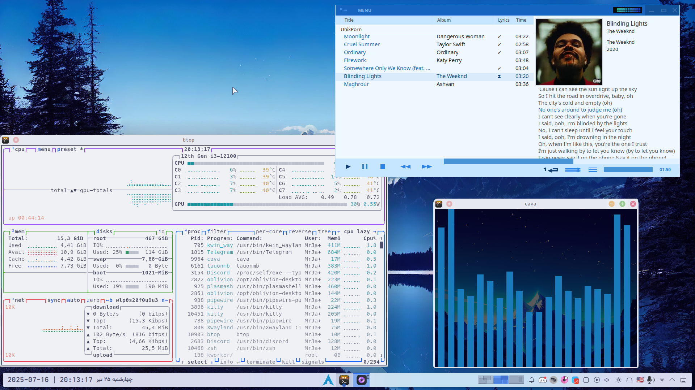
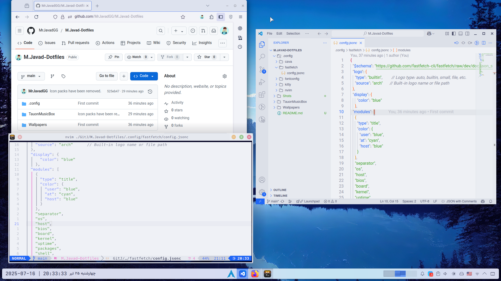

# M.Javad Dotfiles

> [!NOTE]
> Watching the content of this repo is not recomended to Dark-Theme users XD
***


## Stuff

OS: $\color{Blue}\textsf{\textsf{Arch}}$\
DE: $\color{Blue}\textsf{\textsf{KDE  Plasma}}$\
Shell: $\color{Blue}\textsf{\textsf{ZSH}}$\
Terminal: $\color{Blue}\textsf{\textsf{Kitty}}$\
Music player: $\color{Blue}\textsf{\textsf{Tauon music box}}$\
File Manager: $\color{Blue}\textsf{\textsf{Dolphin}}$\
Browser: $\color{Blue}\textsf{\textsf{Firefox}}$\
Editor: $\color{Blue}\textsf{\textsf{VS Code / Neovim}}$


**Theme:** I use [Catppuccin](https://github.com/catppuccin/kde?tab=readme-ov-file#for-kde-plasma-desktop)-(Latte) as my main theme for most of apps and my DE.

**Icons:** [Reversal icon theme](https://github.com/yeyushengfan258/Reversal-icon-theme?tab=readme-ov-file#install).

**Curser:** [Catppuccin-(Light)](https://github.com/catppuccin/cursors?tab=readme-ov-file#installation)


**BTW about the Tauon music box:** I uploaded a .ttheme file (All the colors are written ny myself :D ) which you need to place it in the following directory:
```bash
$HOME/.local/share/TauonMusicBox/theme/
```
*** 
> [!NOTE]
>  I'll update this repo soon. Ask me whatever else you want and I'll upload it for you :)


